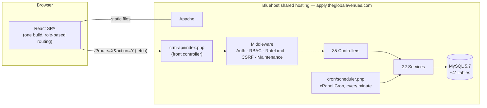

# The Global Avenues — CRM & Student/Agent/Admin Portal

> A production three-portal CRM for **The Global Avenues (TGA)**, an ICEF-certified international
> education consultancy in New Delhi, India. Manages the full student lifecycle — lead capture →
> registration → application → enrollment — plus agent partner management and commission tracking.

[](https://github.com/prashanttiw/TheGlobalAvenues-CRM/actions/workflows/ci.yml)
[](https://react.dev)
[](https://typescriptlang.org)
[](https://vitejs.dev)
[](https://tailwindcss.com)
[](https://php.net)
[](https://mysql.com)
[]()

---

## Table of Contents

1. [What This Is](#1-what-this-is)
2. [System Architecture](#2-system-architecture)
3. [The Three Portals](#3-the-three-portals)
4. [Tech Stack](#4-tech-stack)
5. [Repository Layout](#5-repository-layout)
6. [Getting Started (Local Development)](#6-getting-started-local-development)
7. [Environment Variables](#7-environment-variables)
8. [Available Scripts](#8-available-scripts)
9. [Database](#9-database)
10. [Backend Architecture](#10-backend-architecture)
11. [State Machines](#11-state-machines)
12. [Notifications & Background Jobs](#12-notifications--background-jobs)
13. [Security](#13-security)
14. [Design System](#14-design-system)
15. [Project Conventions](#15-project-conventions)
16. [Off-Limits Files](#16-off-limits-files--never-modify)
17. [Known Limitations & Roadmap](#17-known-limitations--roadmap)
18. [Documentation Map](#18-documentation-map)
19. [Deployment](#19-deployment)
20. [Contributing](#20-contributing)

---

## 1. What This Is

The Global Avenues CRM is the single system that runs TGA's entire student-recruitment business —
from the moment a prospective student first shows interest, through application, offer, and
enrollment abroad. It replaces spreadsheets, email threads, and WhatsApp chats spread across
counsellors and hundreds of agent partners with one shared, always-current system of record.

It ships as **one React single-page application** covering a small public marketing surface (home
page, contact, apply/login) plus **three role-based portals** that all talk to the same PHP/MySQL
backend:

- **Students** browse universities and courses, apply, upload documents, track application status,
  and pay fees.
- **Agents** (TGA's recruitment partners, and their own sub-partners, up to 3 tiers deep) manage a
  student roster, apply on students' behalf, and track commission earnings.
- **Admin staff** run the whole operation — applications, catalog, leads, payments, commissions,
  notices, reporting, and system security.

**Business context:** TGA is an ICEF-certified, AIRC-member consultancy headquartered in New Delhi.
It represents 14+ exclusive university partners and has 600+ active channel partners across South
Asia, the Middle East, and Africa (SAMEA), having recruited 4,000+ students to date.

**Current status:** All 9 build phases are complete; the system is production-ready. Leads,
Commissions, and Reports are functionally complete but currently gated behind an "under development"
notice in the admin UI pending final polish — everything else is live and in active use.

---

## 2. System Architecture



One Bluehost India shared-hosting account (Apache, PHP 8.3 via `ea-php83`, cPanel user `lidglcmy`) serves **both**
the built React app and the PHP backend from the same document root under
`apply.theglobalavenues.com`. There is no separate frontend host and no Node runtime in production —
the SPA is a static build.

**Request flow:** every user action becomes a request shaped as
`/?route=<resource>&action=<action>[/param1/param2]` (not a conventional REST path) hitting the
single entry point `crm-api/index.php`. That front-controller pattern checks auth/permissions, does
the work, and returns JSON — no framework, no page reloads. Separately, `cron/scheduler.php` runs
every minute via a real cPanel Cron Jobs entry and internally dispatches the other background jobs at
their own frequencies (see [§12](#12-notifications--background-jobs)).

**Why no framework:** shared hosting doesn't reliably support the Composer-autoload/service-container
setup modern PHP frameworks assume. Skipping one avoids a fragile dependency chain and framework
upgrade risk, at the cost of writing more plumbing by hand — judged worth it at this scale.

**Why ULIDs, not row IDs:** every record a user can see (student, application, university) has two
identifiers — a sequential integer that never leaves the server, and a 26-character unguessable ULID
that's what actually appears in the browser/API. This kills ID-enumeration attacks while still
sorting in creation order.

---

## 3. The Three Portals

### Student Portal — `/portal/student/*`
Role: `student`. Browse universities/campuses/courses/intakes, submit applications, upload documents,
view notices and payment status, post on an application timeline (only while an active document
request exists). Cannot unilaterally change application status.

### Agent Portal — `/portal/agent/*`
Role: `agent`. Tiers: `bronze` / `silver` / `gold`. 3-level hierarchy via `root_agent_id` +
`parent_agent_id` + `tier` — subtree membership is an O(1) `root_agent_id` comparison, never a
recursive tree walk. Tier 3 has a hard cap on creating further sub-agents. An agent cannot approve
their own student's reassignment request.

### Admin Portal — `/portal/admin/*`
Roles: `admin` and `super_admin`. RBAC via `roles` + `permissions` + `role_permissions` tables,
enforced in `AuthMiddleware`/`RBACMiddleware`, with per-page read/write grants (`PageGuard` on the
frontend). `super_admin` can permanently erase records (30-day window post soft-delete, requires a
logged reason) and trigger global JWT revocation via the `jwt_min_iat` system setting.

---

## 4. Tech Stack

### Frontend

| Package | Version | Notes |
|---|---|---|
| React | ^18.3.1 | |
| React Router | ^7.15.0 | v7 |
| Vite | ^6.4.2 (pnpm pins 6.3.5) | No `tailwind.config.ts` — not used in Tailwind v4 |
| Tailwind CSS | 4.1.12 | Tokens in `src/styles/theme.css`, not `index.css` |
| TanStack Query | ^5.100.14 | v5 — `useQuery` has **no** `onSuccess`/`onError` |
| Zustand | ^5.0.13 | Auth + sidebar state |
| `motion` | 12.23.24 | Import from `'motion/react'`, **not** `'framer-motion'` |
| `@dnd-kit/core` + `/sortable` | ^6.3.1 / ^10.0.0 | Drag-and-drop |
| TipTap | ^3.27.1 | Notices rich-text editor |
| cmdk | 1.1.1 | Command palette / global search |
| Recharts | 2.15.2 | Report charts |
| Radix UI | full suite | Primitives for all UI components |
| `globe.gl`, `three` | — | Marketing homepage 3D globe only |
| `axios`, `react-dnd`, `@mui/material` | present, unused | Not imported anywhere in `src/` — candidates for removal |

### Backend

| Item | Detail |
|---|---|
| PHP | ^8.1 required; **production runs 8.3** (`ea-php83`, confirmed via cPanel MultiPHP Manager); local dev runs 8.2.12 via XAMPP |
| Framework | **None** (deliberate — see [§2](#2-system-architecture)) |
| Composer deps | `openspout/openspout` 4.0 (streaming XLSX), `dompdf/dompdf` ^3.1 (PDF), `phpmailer/phpmailer` ^6.9 |
| Database | **Production runs MySQL 5.7.23** (confirmed via `SELECT VERSION()` on the live account); local dev uses MariaDB 10.4 via XAMPP, which is far more permissive and won't catch MySQL-8-only syntax — see [§9](#9-database) |
| Email | PHPMailer via `MailService` wrapper |

### Hosting

| Layer | Where |
|---|---|
| Frontend + Backend | Same Bluehost India shared-hosting account, served under `apply.theglobalavenues.com` (cPanel user `lidglcmy`) |
| File storage | Local disk — `uploads/public/` (public), `storage/private/` (access-controlled) |
| Cron | Real cPanel Cron Jobs GUI, one `* * * * *` entry driving `cron/scheduler.php` (Terminal/SSH is not available on this hosting plan, but that's unrelated to cron access) |

---

## 5. Repository Layout

```
D:\TheGlobalAvenues-CRM\
├── src/                             # React frontend (single SPA)
│   ├── app/                         # Root app shell (providers, App.tsx)
│   ├── components/
│   │   ├── home/                    # ★ MARKETING ONLY — homepage sections
│   │   └── layout/                  # ★ MARKETING ONLY — public Header/Footer/WhatsApp button
│   ├── data/                        # ★ MARKETING ONLY — company.ts, reports.ts, universities.ts (static)
│   ├── pages/
│   │   ├── HomePage.tsx             # ★ MARKETING ONLY
│   │   ├── ContactPage.tsx          # ★ MARKETING ONLY
│   │   ├── ApplyPage.tsx / LoginPage.tsx / ForgotPasswordPage.tsx   # public auth entry points (in scope)
│   │   ├── admin/                   # 23 admin portal pages
│   │   ├── agent/                   # 17 agent portal pages
│   │   └── student/                 # 9 student portal pages
│   ├── shared/
│   │   ├── components/
│   │   │   ├── layout/              # AuthGuard, RoleGuard, PageGuard, PortalWrapper, TopBar (IN SCOPE)
│   │   │   └── ui/, agent/, student/, catalog/, applications/, activity/   # Shared CRM UI (IN SCOPE)
│   │   └── hooks/                   # useAuth, useNotifications, useSidebarStore
│   ├── layouts/                     # PublicLayout, AdminLayout, AgentLayout
│   ├── router/index.tsx             # All routes — public + 3 portals, portal pages lazy-loaded
│   ├── lib/api.ts                   # ALL API calls — default export `api.get/post/put/delete`
│   └── styles/
│       ├── index.css                # Imports fonts.css, tailwind.css, theme.css
│       ├── theme.css                # ★ TAILWIND TOKENS — @theme inline {} + :root {}
│       ├── tailwind.css             # @import "tailwindcss"
│       └── fonts.css                # Plus Jakarta Sans + Inter
│
├── crm-api/                         # PHP 8.2 backend
│   ├── index.php                    # Entry point — env, CORS, rate limit, route dispatch
│   ├── autoload.php                 # PSR-4 autoloader — namespace root TGA\CRM\
│   ├── .env / .env.example
│   ├── Config/                      # Database.php (PDO singleton), Environment.php, Cors.php, Constants.php, States.php
│   ├── Routes/                      # RouteRegistry.php + feature route files
│   ├── Controllers/                 # 35 controllers
│   ├── Services/                    # 22 services
│   ├── Middleware/                  # Auth, RBAC, Role, RateLimit, CSRF, Maintenance, Validation
│   ├── Models/                      # 19 model files + BaseModel.php
│   └── Helpers/Response.php         # Response::success(), Response::error()
│
├── crm-api/Database/
│   ├── migrations/                  # 001–087 SQL files (★ 048–052 only exist in combined SQL, see §9)
│   ├── all_migrations_combined.sql  # Covers 038–059
│   ├── migrations_060_069.sql / migrations_070_080.sql
│   ├── real_catalog_seed.sql        # Real universities/courses/intakes/campuses data-only export
│   ├── schema.sql                   # Schema snapshot (001–037)
│   ├── reconcile.php                # Safe, non-destructive migration runner (dry-run / --apply)
│   ├── run_all_migrations.php       # Patches an existing DB with 060–089 — NOT a fresh-install tool
│   └── setup_database.php           # ★ USE THIS for fresh setup — full schema + RBAC/config + super admin + real catalog
│
├── cron/                            # 5 job scripts (1 unscheduled, see §12) + master scheduler
│   └── scheduler.php                # cPanel entry — every minute, via flock()
│
├── storage/
│   ├── private/                     # Access-controlled documents (outside public web root)
│   └── cache/settings.json          # SystemSettings dual-layer cache
│
├── uploads/public/                  # Public file uploads
├── scripts/                         # Deployment helper .bat files
└── Implementation_development _docs/
    ├── TGA_CRM_MASTER_REFERENCE.md          # Full spec (single source of truth)
    ├── CLIENT_SYSTEM_DOCUMENTATION.md       # Plain-language + technical system doc, all 3 portals
    ├── PROJECT_HISTORY.md                   # Full build history — what shipped + why, phase by phase
    ├── FULL_SYSTEM_AUDIT_PROMPT.md          # Reusable full-audit kickoff prompt
    ├── FULL_LIVE_QA_TEST_GUIDE.md           # Manual regression checklist
    └── EMAIL_NOTIFICATION_CONTENT_REVIEW.md # Every automatic email/notification, word-for-word
```

**Critical directory distinction:** `src/components/layout/` (marketing header/footer, **off-limits**)
is not `src/shared/components/layout/` (CRM portal shell — auth/role/page guards, **in scope**).

---

## 6. Getting Started (Local Development)

### Prerequisites

| Tool | Version |
|---|---|
| Node.js | v22.13.1 (or any modern LTS) |
| npm | 10.9.x |
| PHP | 8.2.x with the `gd` extension enabled |
| MySQL | via XAMPP (ships MariaDB 10.4), or any local MySQL — production is 5.7.23, so prefer 5.7 locally too if you want migrations to fail the same way they would in production (see [§9](#9-database)) |

### Setup (Windows + XAMPP — the maintained local workflow)

1. **Start XAMPP** — Apache (port 80) + MySQL.
2. Point Apache at the backend: `crm-api` should be reachable at `http://localhost/crm-api/` (a
   directory junction from `C:\xampp\htdocs\crm-api` to this repo's `crm-api/` works well on Windows —
   `mklink /J`, not a symlink, since regular accounts usually lack `SeCreateSymbolicLinkPrivilege`).
3. Create the local database:
   ```bash
   mysql -u root -p tga_crm < crm-api/Database/all_migrations_combined.sql
   php crm-api/Database/setup_database.php   # full schema + RBAC + real catalog + super admin
   ```
4. Copy `crm-api/.env.example` → `crm-api/.env` and fill in local values (see [§7](#7-environment-variables)).
5. Copy the frontend `.env.example` (or create `.env`) with `VITE_API_BASE_URL=http://localhost/crm-api`.
6. Install frontend deps and start the dev server:
   ```bash
   npm install
   npm run dev
   ```
   The app runs at **http://127.0.0.1:3000** (not the Vite default 5173 — see note below).

### Notes specific to this setup

- **Port 3000, not 5173:** Windows (Hyper-V/WSL) dynamically reserves the port range 5143–5242 on
  every boot, which includes 5173, causing intermittent `EACCES` errors. `vite.config.ts` is pinned to
  `host: '127.0.0.1'`, `port: 3000`.
- **`gd` extension required:** `UniversityController::uploadLogo()` calls `imagecreatetruecolor()`.
  Uncomment `extension=gd` in `php.ini` and fully restart Apache (kill `httpd.exe` first if a stale
  process lingers).
- **`uploads/public` path:** the real directory lives at the project root, not nested under `crm-api/`.
  Locally, create a junction at `crm-api/uploads/public` → `../../uploads/public` so file URLs resolve
  the same way they do in production.
- No PHP built-in server command is needed day-to-day — XAMPP's Apache serves the backend. `php -S
  localhost:8080 -t crm-api` remains available as a fallback if you're not using XAMPP.

---

## 7. Environment Variables

### Frontend (`.env` at repo root — not committed)

```
VITE_API_BASE_URL=http://localhost/crm-api
```

### Backend (`crm-api/.env` — not committed; full template at `crm-api/.env.example`)

```
APP_ENV, APP_URL, APP_FRONTEND_URL, APP_NAME, APP_VERSION

DB_HOST, DB_NAME, DB_USER, DB_PASS, DB_CHARSET=utf8mb4, DB_PORT=3306

JWT_ACCESS_SECRET / JWT_REFRESH_SECRET / JWT_RESET_SECRET   # 64-char random strings, all different
JWT_ACCESS_EXPIRY=900        # 15 min
JWT_REFRESH_EXPIRY=604800    # 7 days
JWT_ALGORITHM=HS256

ENCRYPTION_KEY               # base64 of 32 random bytes — php -r "echo base64_encode(random_bytes(32));"
ARGON2_MEMORY_COST=19456
ARGON2_TIME_COST=2

OTP_EXPIRY_MINUTES=10
TRUST_CLOUDFLARE_IP_HEADER=false

GOOGLE_CLIENT_ID, GOOGLE_CLIENT_SECRET, GOOGLE_REDIRECT_URI

MAIL_HOST=smtp.gmail.com, MAIL_PORT=587
MAIL_USERNAME, MAIL_PASSWORD, MAIL_FROM_EMAIL, MAIL_FROM_NAME, MAIL_ENCRYPTION=tls
MAIL_FALLBACK_HOST          # SMTP failover
MAIL_LOGO_URL               # public HTTPS URL of the logo used in email headers

UPLOAD_MAX_SIZE_MB=10
UPLOAD_PATH=uploads
UPLOAD_ALLOWED_TYPES=application/pdf,image/jpeg,image/png,image/webp

RATE_LIMIT_AUTH_REQUESTS=5, RATE_LIMIT_AUTH_WINDOW=60
RATE_LIMIT_OTP_REQUESTS=3, RATE_LIMIT_OTP_WINDOW=600

CORS_ALLOWED_ORIGINS=http://localhost:3000,http://127.0.0.1:3000,https://apply.theglobalavenues.com

LOG_PATH=logs, LOG_LEVEL=debug

# setup_database.php only — never read at runtime
SUPER_ADMIN_NAME, SUPER_ADMIN_EMAIL, SUPER_ADMIN_PHONE, SUPER_ADMIN_PASSWORD
SUPER_ADMIN_2_NAME, SUPER_ADMIN_2_EMAIL, SUPER_ADMIN_2_PHONE, SUPER_ADMIN_2_PASSWORD   # optional, 2nd admin
```

---

## 8. Available Scripts

```bash
# Frontend
npm run dev              # Vite dev server — http://127.0.0.1:3000
npm run build             # Production build → dist/
npx vite preview          # Preview the build ("npm run preview" is not defined in package.json)

# Backend
php -S localhost:8080 -t crm-api          # Standalone PHP server (fallback to XAMPP)
php crm-api/Database/setup_database.php   # Fresh environment: schema + RBAC + super admin + catalog
php crm-api/Database/reconcile.php --dry-run   # Check applied migrations against an existing DB
php crm-api/Database/reconcile.php --apply     # Apply missing migrations safely

# Cron (run manually to test)
php cron/send-notifications.php
php cron/check-sla-breaches.php
php cron/generate-snapshots.php
php cron/monitor-disk.php
php cron/archive-old-logs.php
```

There is no configured lint or test-runner script in `package.json` — `.prettierrc` governs
formatting only.

---

## 9. Database

**Fresh environment:** use `crm-api/Database/setup_database.php` (preferred) or
`all_migrations_combined.sql` + `migrations_060_069.sql` + `migrations_070_080.sql` +
individually-numbered files 081+. `run_all_migrations.php` only patches an existing DB (060–089),
it is not a fresh-install tool. Migrations **048–052** exist only inside the combined SQL, not as
individual files in `migrations/`.

> **Write every migration for MySQL 5.7, not whatever passes locally.** Production is MySQL 5.7.23;
> local dev's MariaDB 10.4 (via XAMPP) is far more permissive and will silently accept syntax that
> breaks in production. Known things 5.7 lacks that have already bitten this project: no `DEFAULT`
> value (literal or expression) on `JSON`/`TEXT`/`BLOB` columns, no `DROP COLUMN IF EXISTS` / `ADD
> COLUMN IF NOT EXISTS` (needs 8.0.29+), no CTEs (`WITH`), no window functions, no `CREATE ROLE`, no
> functional/expression indexes. When a migration needs to be conditional, use an
> `INFORMATION_SCHEMA`-driven check (stored procedure + dynamic SQL) instead of a version-gated DDL
> modifier. `reconcile.php` is safe against MySQL 5.7 for this reason — always prefer it over hand
> rolling a new patch script.

~41 tables, grouped by domain:

| Domain | Tables |
|---|---|
| Identity & auth | `users`, `user_sessions`, `otp_verifications`, `security_events`, `rate_limits`, `roles`, `permissions`, `role_permissions` |
| Profiles | `admins`, `agents`, `students`, `student_academics`, `student_test_scores`, `agent_reassignment_requests` |
| Catalog | `universities`, `courses`, `intakes` |
| Applications | `applications`, `application_updates`, `document_requests`, `application_payments` |
| CRM | `leads`, `commissions`, `commission_audit_log`, `agent_stats` |
| Comms | `notices`, `internal_notes`, `notification_templates`, `notifications` |
| Ops | `sla_rules`, `sla_events`, `user_preferences`, `activity_logs`, `activity_logs_archive`, `report_snapshots`, `api_request_logs`, `cron_health`, `system_settings`, `sequences`, `files`, `pending_registrations` |

**PII encryption pattern** (used on email/phone and similar sensitive columns):

```
email_encrypted BLOB          ← EncryptionService::encrypt(email)   [XSalsa20-Poly1305, not AES-GCM]
email_lookup_hash VARCHAR(64) ← EncryptionService::hash(email)      ← used for WHERE clauses
```

AES-NI hardware acceleration isn't guaranteed on Bluehost shared hosting, so `EncryptionService` uses
`sodium_crypto_secretbox` (XSalsa20-Poly1305) instead — a stale column comment in
`001_create_users_table.sql` still says "AES-256-GCM"; the code is the source of truth.

**Soft deletes everywhere:** every entity has `deleted_at DATETIME NULL`; app code always filters
`WHERE deleted_at IS NULL` and never hard-deletes. The only exception is the `super_admin` erase flow
(30-day window, requires a logged reason).

**`activity_logs` is INSERT-only**, enforced at the DB grant level in production — always write
through `ActivityLogger::log()`, never `UPDATE`/`DELETE` that table.

---

## 10. Backend Architecture

### API convention

Not REST — a single front controller with a query-string convention:

```
/?route=<resource>&action=<action>[/param1/param2]
```

Example: `POST /?route=auth&action=login` · `GET /?route=applications&action=get/01H8X...`

### Controllers (35) — highlights

| Controller | Responsible for |
|---|---|
| `AuthController` | Login, logout, refresh, 2FA verify/toggle |
| `RegistrationController` | Student / agent / admin registration flow |
| `ApplicationController` | Application CRUD + state transitions (via `StateManager`) |
| `AgentController` / `SubAgentController` / `AdminAgentController` | Agent portal, hierarchy, admin approval workflow |
| `CommissionController` | Commission create / confirm / paid |
| `DocumentController` / `DocumentRequestController` / `FileController` | Uploads, request lifecycle, chunked authenticated download |
| `LeadsController` | Public lead intake (rate-limited, CORS-restricted) + pipeline CRUD |
| `NoticeController` / `NotificationController` | Notice publishing, in-app fetch/mark-read |
| `ReassignmentController` | Agent reassignment request + approval |
| `SearchController` | Global search — single `UNION ALL` across 5 entities, min 3 chars |
| `AdminDashboardController` / `AdminReportsController` | Dashboards & reports, reading from `report_snapshots` |
| `SystemSettingsController` / `RoleController` | Admin-only config and RBAC management |

Full list of all 35 in `crm-api/Controllers/`.

### Services (22) — highlights

| Service | Owns |
|---|---|
| `StateManager` | The **only** application state machine actually used — 20 states, transactional (`FOR UPDATE`), fires notifications + SLA events |
| `ApplicationStateManager` | **Dead code** — simple 5-state machine, fully implemented but never called from anywhere |
| `EncryptionService` | XSalsa20-Poly1305 `encrypt()`/`decrypt()` + SHA-256 `hash()` for lookup columns |
| `JWTService` | Custom HS256 JWT (no external library) — `jti` claim, access + refresh + reset tokens |
| `NotificationService` | `fire(eventKey, vars, userIds)` — resolves template, queues notification; silently no-ops if no template row exists |
| `OTPService` / `OTPResult` | OTP generation/verification, rate limit checked **before** any DB write |
| `SLAService` | `startEvent()` / `resolveEvent()` / `cancelEvent()` |
| `CommissionService` | Commission CRUD, transitions, agent-chain validation |
| `PendingRegistrationService` | Multi-step registration state kept in the DB (not PHP sessions — shared `/tmp` on Bluehost is a cross-tenant risk) |
| `SystemSettings` | Dual-layer cache — PHP static array (intra-request) + `storage/cache/settings.json` |
| `MailService` | PHPMailer wrapper — `sendNow()` (synchronous, e.g. OTP) + `sendQueued()` (batched) |
| `AdminPageAccessService` / `AgentAccessService` | Per-page read/write RBAC resolution |
| `HtmlSanitizer` / `ImageProcessor` | Notice HTML sanitization; avatar/logo image processing |

Always use `Database::getConnection()`, never `Database::connect()`.

---

## 11. State Machines

### Application status (`applications.status`)

`StateManager` (transactional, the one actually wired into `ApplicationController`) supports 20
states: `inquiry`, `draft`, `submitted`, `under_review`, `profile_review`, `documents_submitted`,
`offer_received`, `conditional_offer`, `unconditional_offer`, `waitlisted`, `rejected`, `withdrawn`,
`cas_coe_issued`, `visa_applied`, `visa_approved`, `visa_rejected`, `pre_departure`, `departed`,
`enrolled`, `deferred`. Every transition runs inside `beginTransaction()` with `FOR UPDATE`, and fires
`NotificationService::fire('application.status_changed', ...)` plus SLA events. On `enrolled`, sets
`students.agent_lock_status = 'locked'`.

### Other machines

| Entity | Flow |
|---|---|
| Agent status | `pending` → `approved` → `suspended` (admin only). Admin-direct creation (`AdminAgentController::create()`) skips straight to `approved`, no `pending`/documents/review step — see §17. |
| Document request | `requested` → `submitted` → `approved`; rejection loops `submitted` → `requested`; app withdrawal → `cancelled` |
| Payment | `pending` → `student_marked_paid` → `confirmed`; `confirmed` ⇄ `disputed`; app withdrawal → `cancelled` |
| Commission | `pending` → `confirmed` → `paid` — **immutable once paid** (PHP guard + DB trigger) |
| Agent reassignment | `pending` → `approved` / `denied` |
| SLA event | `active` → `breached` (every 15 min) or → resolved; app withdrawn/rejected → `cancelled` |

---

## 12. Notifications & Background Jobs

`NotificationService::fire(eventKey, vars, userIds)` resolves an event key against
`notification_templates` and queues it — a missing template silently no-ops rather than crashing.
There are **36 notification types** across auth, agent lifecycle, reassignment, commission, and lead
pipeline events (29 by email, 7 in-app only). As of 2026-07-14, every automatic email is branded HTML
with no links or buttons — a link audit found several pointing at stale/wrong destinations, so rather
than keep maintaining links against a marketing site that keeps changing, all clickable elements were
removed from every transactional email system-wide. Full content review:
`Implementation_development _docs/EMAIL_NOTIFICATION_CONTENT_REVIEW.md`.

### Cron schedule

One cPanel entry — `* * * * * /usr/local/bin/ea-php83 <docroot>/cron/scheduler.php` — internally
dispatches everything else via `flock()` + `scheduler_state.json`:

| Script | Frequency | Purpose |
|---|---|---|
| `send-notifications.php` | Every 1 min | Email + in-app queue dispatch |
| `check-sla-breaches.php` | Every 15 min | SLA breach detection |
| `generate-snapshots.php` | Every 24 hr | Pre-compute report metrics → `report_snapshots` |
| `monitor-disk.php` | Every 12 hr | Disk usage alerts at 80%/95% |

**`archive-old-logs.php` exists in `cron/` but is deliberately *not* in `scheduler.php`'s job
list** — `activity_logs` must never be deleted (product decision 2026-07-08), and its only other
job (pruning `security_events`) wasn't judged worth running alone. It's dead weight in the
directory, not a scheduled job; don't re-add it without a product decision to revisit log retention.

Google Drive backup sync and the payment-reminder engine were deliberately removed from the codebase
(2026-07-10) — they were never load-bearing in production. `FOR UPDATE SKIP LOCKED` rows must be
marked `processing` **before** the transaction commits, not after, or duplicate processing occurs.

---

## 13. Security

- **Passwords:** `PASSWORD_ARGON2ID`, memory/time cost from env.
- **Sessions:** access token in memory (Zustand, cleared on tab close) + HttpOnly refresh cookie —
  never `localStorage`.
- **RBAC:** `roles` + `permissions` + `role_permissions`, checked centrally in `AuthMiddleware` /
  `RBACMiddleware`, with per-admin-page read/write grants.
- **Rate limiting:** dual-key (IP + email hash) via `RateLimitMiddleware`, tunable per env vars.
- **Global JWT revocation:** `system_settings.jwt_min_iat`, checked on every authenticated request —
  a super_admin action invalidates every issued token instantly.
- **File downloads:** 8KB chunked `fread()`, never `readfile()` (memory exhaustion risk); ownership
  checked via `owner_type`/`owner_id`, not the uploader.
- **CSRF / maintenance / validation:** dedicated middleware layers, run before controller dispatch.
- **Audit trail:** `activity_logs` (INSERT-only) + `security_events` (failed logins, blocked
  requests) via `SecurityEventLogger`.
- **Leads endpoint:** the only public unauthenticated write endpoint — CORS-restricted to
  `theglobalavenues.com` (not `*`) and rate-limited to reduce spam/scraping.

---

## 14. Design System

- **Tokens:** CSS custom properties in `src/styles/theme.css`'s `:root {}` block, bridged to Tailwind
  utilities via the same file's `@theme inline {}` block. Tailwind v4 has no `tailwind.config.ts`.
- **Brand colors:** `#D96200` (`--color-brand-orange-accessible`) for interactive elements (WCAG AA
  compliant); `#FD7E14` (`--primary`) for decorative highlights only — do not swap these roles.
- **Fonts:** Plus Jakarta Sans (body/UI), Inter.
- **Dark mode:** `.dark {}` overrides live in the same `theme.css` file.

---

## 15. Project Conventions

**Naming**
- PHP classes: `PascalCase`, file name matches class name exactly. Namespace root `TGA\CRM\` — any
  class in `crm-api/Services/Foo.php` is `TGA\CRM\Services\Foo`.
- JS/TS components: `PascalCase`. Hooks: `camelCase` starting with `use`.
- DB tables: `snake_case`, plural. Columns: `snake_case`.
- Route action segments: `kebab-case` (e.g. `verify-2fa`, `mark-read`).

**Frontend API client (`src/lib/api.ts`)**
Named function exports per endpoint, plus a default `api` export with `.get/.post/.put/.delete`
helpers using `formatPath()` internally.

**Working rules**
1. Discuss first, implement on approval — don't generate files unless explicitly asked.
2. One change at a time; verify via a live test, not just a code read.
3. `activity_logs` is INSERT-only — use `ActivityLogger::log()`, never `UPDATE`/`DELETE`.
4. Always `Database::getConnection()`, never `Database::connect()`.
5. No hard deletes in application code — soft delete only, except the `super_admin` erase flow.
6. Never touch the off-limits marketing zone below, under any framing.

---

## 16. Off-Limits Files — Never Modify

The public marketing surface — never touch during CRM work:

```
src/pages/HomePage.tsx
src/pages/ContactPage.tsx
src/components/home/          (entire directory — homepage sections)
src/components/layout/        (entire directory — marketing Header/Footer/WhatsApp button)
src/data/                     (entire directory — company.ts, reports.ts, universities.ts static data)
```

`src/pages/ApplyPage.tsx`, `LoginPage.tsx`, and `ForgotPasswordPage.tsx` are public routes but **are**
in scope — they're the auth entry points into the CRM portals, not marketing content.

> The marketing site was trimmed at some point to a single home page plus contact/apply/login — routes
> for a separate Destinations/Universities/Courses/Partners/About marketing site referenced in older
> project notes no longer exist in `src/router/index.tsx` or on disk. Treat the router file as the
> source of truth for what's actually live.

---

## 17. Known Limitations & Roadmap

- **Leads, Commissions, and Reports** are feature-complete but gated behind an admin-facing "still
  being finished" notice pending final polish.
- **Migrations 048–052** exist only inside `all_migrations_combined.sql`, not as individual files —
  fine for `setup_database.php`, but any per-file migration tooling will skip them.
- **`ApplicationStateManager`** is fully implemented but confirmed dead code (no caller anywhere) —
  safe to delete in a future cleanup pass.
- **`react-dnd`, `axios`, `@mui/material`** are in `package.json` but unused anywhere in `src/` —
  candidates for removal to shrink the bundle.
- **Payment reminders and Google Drive backup sync were removed from the codebase entirely on
  2026-07-10** (11 files) — neither was ever load-bearing in production. Don't look for a reminder
  engine or Drive integration; they no longer exist.
- **`npm run preview`** isn't defined — use `npx vite preview`.
- **Admin-direct agent creation** (`AdminAgentController::create()`, 2026-07-26) always creates a
  Tier-1 (root) agent — it doesn't currently support placing the new account as someone's
  sub-agent. The new agent gets a temp password by email and must change it on first login
  (`users.must_change_password`, enforced in `RoleGuard.tsx`).

See `Implementation_development _docs/PROJECT_HISTORY.md` and `CLIENT_SYSTEM_DOCUMENTATION.md` §9 for
the full, current list with technical detail.

---

## 18. Documentation Map

| What | Where |
|---|---|
| Condensed AI-session brief (architecture, gotchas, hotfix history) | `CLAUDE.md` |
| Full plain-language + technical system doc (all 3 portals) | `Implementation_development _docs/CLIENT_SYSTEM_DOCUMENTATION.md` |
| Full authoritative spec | `Implementation_development _docs/TGA_CRM_MASTER_REFERENCE.md` |
| Full build history — what shipped + why + notable bugs, phase by phase | `Implementation_development _docs/PROJECT_HISTORY.md` |
| Reusable full-audit kickoff prompt | `Implementation_development _docs/FULL_SYSTEM_AUDIT_PROMPT.md` |
| Manual regression checklist | `Implementation_development _docs/FULL_LIVE_QA_TEST_GUIDE.md` |
| Every automatic email/notification, word-for-word | `Implementation_development _docs/EMAIL_NOTIFICATION_CONTENT_REVIEW.md` |
| Full deployment runbook, backup → upload → DB → cron → verify → rollback | `Implementation_development _docs/DEPLOYMENT_MASTER_RUNBOOK.md` |
| One-time production DB setup steps (no-SSH Bluehost workaround) | `Implementation_development _docs/PRODUCTION_SETUP_RUNBOOK.md` |
| Authoritative DB schema | `crm-api/Database/all_migrations_combined.sql` + `migrations/` |
| All API routes | `crm-api/Routes/api.php` → feature route files |

---

## 19. Deployment

Production is a single Bluehost India shared-hosting account:

- **Frontend:** `npm run build` → upload `dist/` to the `apply.theglobalavenues.com` document root.
- **Backend:** upload `crm-api/` (and `cron/`, `storage/`, `uploads/`) alongside it — same document
  root, no separate host.
- **Cron:** one cPanel Cron Jobs entry, `* * * * *`, pointed at `cron/scheduler.php` with the
  server's PHP CLI binary (`ea-php83` on this account).
- **Database:** run `crm-api/Database/setup_database.php` once against a fresh MySQL 5.7 database, or
  `reconcile.php --dry-run` / `--apply` to bring an existing database up to date safely. Bluehost has no
  SSH/Terminal, so this CLI script has to run via a one-shot cPanel Cron Jobs entry — see
  `Implementation_development _docs/PRODUCTION_SETUP_RUNBOOK.md` for the exact steps.
- **SPA routing:** Apache `.htaccess` must have `RewriteEngine On` with a fallback to `index.html` for
  client-side routes, and a separate rewrite in `crm-api/.htaccess` for the API front controller.

Server/deployment commands should be run one step at a time with confirmation at each step — this is
a live production system on shared hosting, not a disposable environment.

---

## 20. Contributing

**Code style**
- TypeScript — avoid `any`. Prettier formatting (`.prettierrc` at root).
- Component files: PascalCase. Data files: camelCase. All imports use the `@/` alias for `src/`.
- PHP: PascalCase classes matching filenames, PSR-4 under `TGA\CRM\`.

**Commit convention**
```
feat: add campus-level intake filtering to university catalog
fix: correct commission chain resolution for tier-3 sub-agents
style: update admin dashboard card spacing
docs: update README with current route list
refactor: extract PageGuard permission check into a hook
```

**Before any change:** read `CLAUDE.md` for the always-loaded brief, and
`Implementation_development _docs/PROJECT_HISTORY.md` for the full build history when you need depth
on a specific area.

---

## License

Private — The Global Avenues. All rights reserved.

## Contact

**The Global Avenues**
- Email: connect@theglobalavenues.com
- Website: https://theglobalavenues.com
